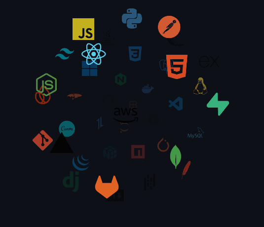



  

<table border="0">
  <tr>
    <td width="60%" valign="middle">
       
      
      
      
      
        
       
      
      
      
      
        
       
      
      
      
      
      
      
      
      
      
      
      
      
      
      
      
      
      
      
      
      
      
      
      
      
      
      
    </td>
    <td width="40%" align="center" valign="middle">
      <picture>
        <source media="(prefers-color-scheme: dark)" srcset="./assets/Skills_Animation_Dark.gif">
        <source media="(prefers-color-scheme: light)" srcset="./assets/Skills_Animation_White.gif">
          
      </picture>
    </td>
  </tr>
</table> 

  

    

    
    

    
    

  

